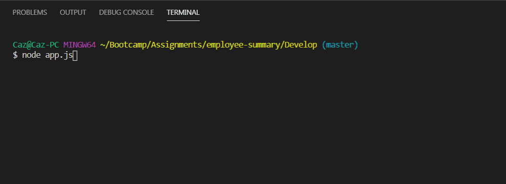
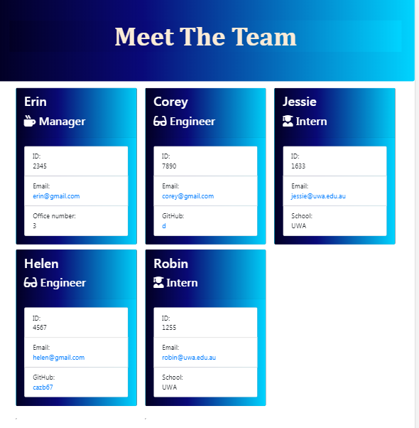
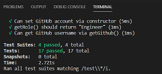

# Team Generator - Employee Summary
Object Oriented Programming and Test Driven Development

## Description
  
  


The task was to build a software engineering team generator command line application. The application prompts the user for information about the team manager and then information about the team members. The user can input any number of team members, and they may be a mix of engineers and interns. This application also needed to pass all unit tests. When the user has completed building the team, the application will create an HTML file that displays a nicely formatted team roster based on the information provided by the user. 

## Table of Contents
1. [Installation](#Installation)
2. [Usage](#Usage)
3. [Technologies](#Technologies)
4. [Credits](#Credits)
5. [Contributing](#Contributing)
6. [Tests](#Tests)
7. [Bugs](#Bugs)
8. [Licence](#License)


## Installation
1. Write code to build out Engineer, Intern and Manager classes 
2. Write code to use inquirer to gather information about team members and to create objects for each team member.
3. Call the `render` function and pass in employees array.
4. Create `output` folder.
5. Using the HTML returned, write it to a file named `team.html` in the `output` folder. 
6. Run tests
7. Add CSS

## Usage
To use this application run the following in the command line:

```
node app.js
```
The user is then prompted with a series of questions like so.  



When the user has finished answering the questions a `team.html` file is generated with all the information. It looks like so.  


## Technologies
NPM, Node js, fs, inquirer, Javascript, Jest(for testing)

## Credits
- Team at UWA Coding Bootcamp
- This website for how to use inquirer to validate responses https://github.com/sameeri/Code-Inquirer/wiki/Asking-questions-away-with-Inquirer!
- Email validation help - https://www.w3resource.com/javascript/form/email-validation.php
- Responsive cards - https://stackoverflow.com/questions/34140793/bootstrap-4-responsive-cards-in-card-columns

## Contributing
[](code_of_conduct.md)

## Tests 



To run tests, run the following command:
​
```
npm run test
```
## Bugs
There is an asynchronous issue with github validation I think. After a new engineer has been added. The app gets stuck on the next employee's name. The problem is resolved by pressing enter but I would rather it not be there.

## License
  